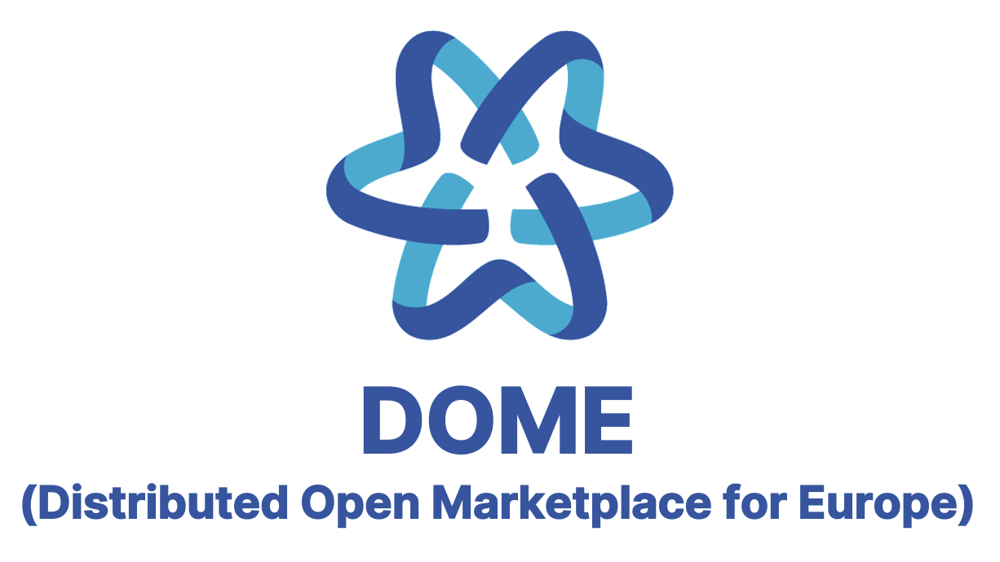
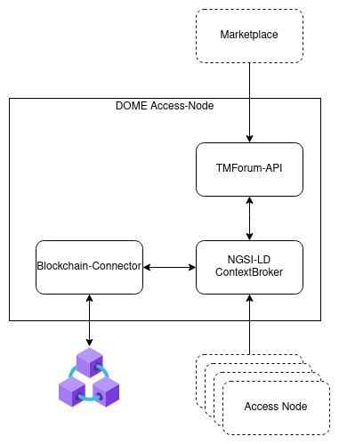
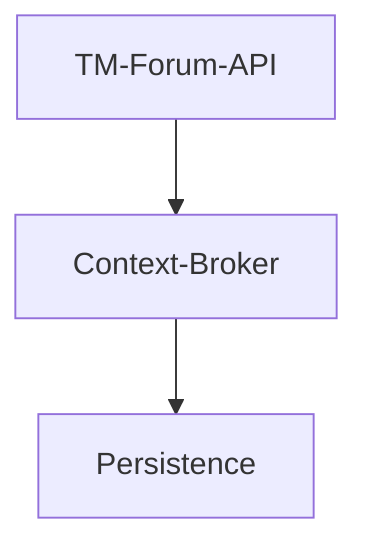
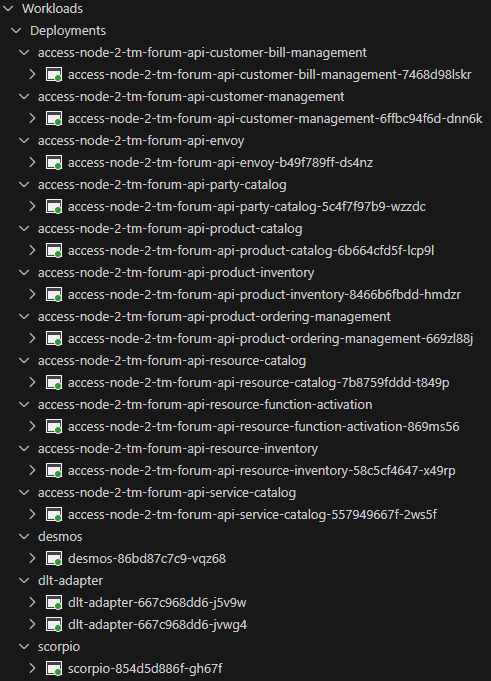
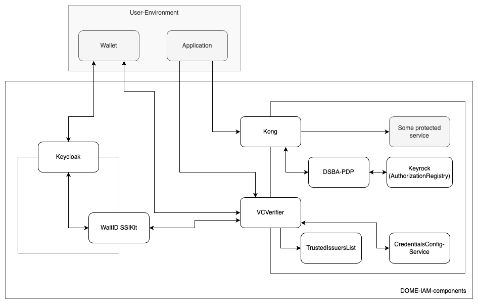

# DOME Marketplace Integration and Federation Guide




<!-- ToC created with: https://github.com/thlorenz/doctoc -->
<!-- Update with: doctoc README.md -->
<!-- Will be also updated during pre-release/release GitHub workflow -->

<!-- START doctoc generated TOC please keep comment here to allow auto update -->
<!-- DON'T EDIT THIS SECTION, INSTEAD RE-RUN doctoc TO UPDATE -->
<!-- param::title::**Table of Contents**:: -->
**Table of Contents**

- [Introduction](#introduction)
  - [Who is this guide for?](#who-is-this-guide-for)
  - [What is DOME?](#what-is-dome)
  - [What will I accomplish following this guide?](#what-will-i-accomplish-following-this-guide)
  - [Pre-requisites](#pre-requisites)
- [Onboarding as a DOME Service Provider with did:web](#onboarding-as-a-dome-service-provider-with-didweb)
  - [What will I accomplish following this section?](#what-will-i-accomplish-following-this-section)
  - [Pre-requisites](#pre-requisites-1)
  - [Install and configure Keycloack as a Verifiable Credential Issuer](#install-and-configure-keycloack-as-a-verifiable-credential-issuer)
  - [Configure the Credential type and the Claims in the Issuer](#configure-the-credential-type-and-the-claims-in-the-issuer)
  - [Issue and receive the Verifiable Credential in your Wallet](#issue-and-receive-the-verifiable-credential-in-your-wallet)
  - [Login to the DOME BAE Marketplace instance](#login-to-the-dome-bae-marketplace-instance)
  - [Create a Product Offering in the DOME BAE Marketplace instance](#create-a-product-offering-in-the-dome-bae-marketplace-instance)
  - [Logoff from the DOME BAE Marketplace instance](#logoff-from-the-dome-bae-marketplace-instance)
- [Distributed components](#distributed-components)
  - [Access Node](#access-node)
    - [Overview and sub-components](#overview-and-sub-components)
    - [Infrastructure requirements](#infrastructure-requirements)
    - [How to deploy](#how-to-deploy)
    - [How to configure](#how-to-configure)
      - [Desmos profiles](#desmos-profiles)
      - [Configure custom secrets](#configure-custom-secrets)
    - [How to validate a deployment](#how-to-validate-a-deployment)
    - [How to operate](#how-to-operate)
    - [How to update](#how-to-update)
    - [Release process](#release-process)
    - [Troubleshooting](#troubleshooting)
      - [Timeouts occur while querying TM-Forum-API](#timeouts-occur-while-querying-tm-forum-api)
  - [IAM components](#iam-components)
    - [Overview and subcomponents](#overview-and-subcomponents)
    - [How to deploy](#how-to-deploy-1)
    - [How to configure](#how-to-configure-1)
    - [How to validate a deployment](#how-to-validate-a-deployment-1)
    - [How to operate](#how-to-operate-1)
    - [How to update](#how-to-update-1)
    - [Release process](#release-process-1)
    - [Troubleshooting](#troubleshooting-1)
- [Authentication](#authentication)
- [Integration API (TMForum)](#integration-api-tmforum)
  - [How to retrieve your organization party](#how-to-retrieve-your-organization-party)
  - [How to create custom categories](#how-to-create-custom-categories)
  - [How to discover product offerings](#how-to-discover-product-offerings)
  - [How to publish a product offering](#how-to-publish-a-product-offering)
    - [Service and Resource Specifications](#service-and-resource-specifications)
    - [Product Specification](#product-specification)
    - [Compliance profile](#compliance-profile)
    - [Product Offering](#product-offering)
      - [Adding information for Replication and Access Control](#adding-information-for-replication-and-access-control)
  - [How to subscribe to events](#how-to-subscribe-to-events)
  - [Billing & Payment](#billing--payment)
    - [How to check if recurring payments have been made](#how-to-check-if-recurring-payments-have-been-made)
- [Policies](#policies)
  - [Defining policies](#defining-policies)
    - [Local policies](#local-policies)
    - [Distributed policies](#distributed-policies)
  - [Enforcing policies](#enforcing-policies)
    - [In front of TMForum API](#in-front-of-tmforum-api)
    - [In front of Context Broker API](#in-front-of-context-broker-api)

<!-- END doctoc generated TOC please keep comment here to allow auto update -->


## Introduction

This guide provides detailed, self-contained and actionable technical instructions for integrating and federating a marketplace in DOME.  
It is meant to be the reference for what is _currently_ technically available and ready to be used. When additional functionality, components and/or 
instruction get available, this guide will be adapted accordingly.

This guide limits on the technical details and therefore is not providing any details about contractual 
and business aspects of the marketplace integration and federation.


### Who is this guide for?

This guide aims for future participants willing to technically integrate and federate a marketplace in DOME. Descriptions and instructions are 
given as a comprehensive, step-by-step guide in such detail, so that IT and engineering teams can successfully and efficiently 
perform the necessary steps without profound knowledge of the DOME implementation details.

Nevertheless, this guide focusses on the actual integration of a marketplace in DOME, providing only the information 
needed to perform the actual setup for integration and federation. More details and in-depth knowledge about DOME and its involved 
components can be found in the linked resources.

The suggested deployment target infrastructure is [Kubernetes](https://kubernetes.io/). Therefore a sufficient 
knowledge of Kubernetes and [Helm](https://helm.sh/) is expected when following this guide. Knowledge about 
[ArgoCD](https://argo-cd.readthedocs.io/en/stable/) is also helpful when using it as GitOps 
continuous delivery tool.  
This guide requires access to a domain and it's DNS settings, as well as configuring proper certificates. 
Therefore also knowledge about [cert-manager](https://cert-manager.io/) 
and [external-dns](https://github.com/kubernetes-sigs/external-dns) is recommended.  
Authentication requires usage of decentralized identifiers and verifiable credentials, which requires an 
appropriate configuration of the related components. Therefore, the reader of this guide should be 
familiar with [DIDs](https://www.w3.org/TR/did-core/) and [VC/VP standards](https://www.w3.org/TR/vc-data-model/).


### What is DOME?

Cloud computing is identified as a central piece of Europe’s digital future, giving European
businesses and public organisations the data processing technology required to support their
digital transformation. 
The European Commission thereby stepped up its efforts to support
cloud uptake in Europe as part of its strategy, notably with the pledge to facilitate "the set-up
of a cloud services marketplace for EU users from the private and public sector". 
DOME is
materialising the envisioned online marketplace, providing the means for accessing trusted
services, notably cloud and edge services, building blocks deployed under the Common
Services Platform and more generally any software and data processing services developed
under EU programmes such as the Digital Europe Programme, Horizon 2020 or Horizon
Europe.

Relying on Gaia-X concepts and open standards, DOME is providing the finishing touch to the
technical building that the Digital Europe Program is creating for boosting the development
and adoption of trusted Cloud and Edge services in Europe. It will provide the single point for
enabling customers and service providers to meet each other in a trustful manner. DOME is 
taking the form of a federated collection of marketplaces connected to a shared digital catalogue
of cloud and edge services. Each of the federated marketplaces will be independent or
connected to the offering of a given cloud/edge infrastructure service provider which, in turn,
can be classified as cloud IaaS providers or cloud platform service providers (each of which
provide a platform targeted to solve the integration of vertical data/application services from a
given vertical domain, like smart cities or smart farming, or the integration of certain type of
data/application services, e.g., AI services). DOME is relying on the adoption of common open
standards for the description and the management of the lifecycle of cloud and edge service
products and offerings around those products, as well as their access or match-making
services through a shared catalogue.


### What will I accomplish following this guide?

After following this guide, you will have a complete and functioning integration of a marketplace 
in a federated DOME environment.

The following sections provide details about the necessary steps:
* [Onboarding](#onboarding-as-a-dome-participant): How to perform onboarding as DOME participant (Note, 
  that this topic is currently under discussion and details will be added later).
* [Distributed components](#distributed-components): How to configure, deploy and operate the different 
  required components. This involves the access node and components required for the IAM.
* [Authentication](#authentication): How to authenticate at services and how to implement the authentication.
* [Integration API](#integration-api-tmforum): How to integrate with the TMForum APIs, especially when using an 
  own marketplace implementation instead of the BAE. Some samples and tutorials are given for core federation 
  scenarios.
* [Policies](#policies): How access policies are defined, created and enforced (Note, 
  that this topic is currently under discussion and details will be added later).


### Pre-requisites

There are some prerequisites that need to be fulfilled before following this guide:
* Domain: You need control over an own domain and have access to the DNS settings.
* Public access: Certain components need to be publicly accessible under your own domain. Therefore, a suitable 
  infrastructure (like a cloud-hosted Kubernetes cluster) is required for running the components.
  
Additional prerequisites are provided in the different sections.


## Onboarding as a DOME Service Provider with did:web

### What will I accomplish following this section?

We describe here the onboarding process using Verifiable Credentials with the `did:web` DID method. In production (June 2024) the process will use `did:elsi` and eIDAS certificates, but this process will be finished in the coming weeks, so for the moment the users will be able to test onboarding and creation of Product Offerings and replication to other marketplaces, even if the actions do not have yet the legal coverage that `did:elsi` provides.

The user will be able to login with her Wallet in the DOME BAE Marketplace instance (the one operated at this moment by the DOME project) as a Service Provider with a unique identity determined by the domain (e.g., www.in2.es) used when generating the Verifiable Credential used to login to the BAE Marketplace.

Once logged-in, the user will be able to test the creation of a Product Offering using the screens of the DOME BAE Marketplace instance, and publish the Product Offering in the marketplace. The Product Offering will be replicated to all other federated marketplaces connected to the main DOME Marketplace instance.

All Product Offerings and related entities created under this identity will be separated from the other entities created by other identities.

### Pre-requisites

This scenario uses the [`did:web` DID Method](https://w3c-ccg.github.io/did-method-web/), so you need control over a domain and have access to the DNS settings.

Before continuing, you have to create your DID, following the instructions in the section [Create (Register)](https://w3c-ccg.github.io/did-method-web/#create-register) of the `did:web` specification.

### Install and configure Keycloack as a Verifiable Credential Issuer

You need to be able to issue a Verifiable Credential to a Wallet, using the DOME format and with the `did:web` method. There are different possibilities, but the easiest one which ensures compatibility with the current status of the OID4SSI implementation in DOME is to use the Wallet and Issuer provided by DOME.

**Wallet**: in order to use the Wallet provided by DOME, you do not have to install anything. Just visit with your mobile the URL: https://demo-wallet.fiware.dev/

**Issuer**: the Issuer is a little bit more involved. Before June, DOME will provide an Issuer acting As-a-Service (for those willing to use it), but for the moment you have to install and operate an instance the Issuer yourself.

The instructions to install and configure the Issuer (which is based on Keycloack) are here: [Keycloack VC-Issuer](https://github.com/FIWARE/keycloak-vc-issuer). For a simple installation, the repo includes a containerised deployment so you only have to configure the Issuer with your specific information.

The Wallet should be able to access the relevant endpoints exposed by the Issuer, as described in the instrucions mentioned above.

### Configure the Credential type and the Claims in the Issuer

Follow the instructions in [Configure claims for Credential-Types](https://github.com/FIWARE/keycloak-vc-issuer?tab=readme-ov-file#configure-claims-for-credential-types) to configure your Issuer for issuance of the Credential required for DOME.

### Issue and receive the Verifiable Credential in your Wallet

Follow the instructions in section [Demo](https://github.com/FIWARE/keycloak-vc-issuer?tab=readme-ov-file#demo) to make Keycloack issue a QR code that can be scanned by your Wallet (remember that your Wallet is at https://demo-wallet.fiware.dev/).

Once you scan the QR code and complete the issuance process, you will have in your Wallet the required credentials to login in the DOME BAE Marketplace.

### Login to the DOME BAE Marketplace instance

At this moment, you have in your mobile the credentials required to login to the DOME BAE Marketplace instance with a unique identity associated to your unique domain. Even though this credential does not have the level of legal certainty required for production use, it will allow you to test the features that the DOME BAE Marketplace instance provides to Service Providers.

> TODO: add instructions to login to the DOME BAE Marketplace instance.

### Create a Product Offering in the DOME BAE Marketplace instance

Once logged in, you are logged as a Service Provider with a unique identity associated to your unique domain. You can start creating Product Offerings and publishing them. The action of publishing the Product Offernings will make them visible to potential customers in the DOME BAE Marketplace instance and all other federated marketplaces which are connected to the DOME main instance.

> TODO: add instructions to create and publish Product Offerings.

### Logoff from the DOME BAE Marketplace instance

Once you have finished interacting with the DOME BAE Marketplace instance, you can logoff from it. In case of inactivity, the BAE Marketplace will log you off automatically.

Using your Wallet, you can login at any moment and continue working with the DOME BAE Marketplace. The Wallet has your credentials stored in your device and you can use them at any moment.


## Distributed components

> Components that need to be operated by a federated participant.

### Access Node

The [DOME Access-Node](https://github.com/DOME-Marketplace/access-node) is a set of services for the integration with the DOME Marketplace. A registered participant can use it to act as a federated marketplace in DOME.

The Access-Nodes consists of 3 logical componentes:



The TM-Forum-API Service is a service providing a growing subset of
the [TMForum API](https://www.tmforum.org/oda/open-apis/table)'s while using
an [NGSI-LD](https://www.etsi.org/deliver/etsi_gs/CIM/001_099/009/01.06.01_60/gs_CIM009v010601p.pdf) context broker as
persistence backend and change notificator.



The Blockchain Connector is a software component that facilitates the
interaction between the Off-Chain Storage (Context Broker) and the
On-Chain Storage (Blockchain). 
It is composed of the Distributed Ledger Technology (DLT) and the Access Node.

#### Overview and sub-components

The TM-Forum-API service is a cluster of individual services providing one specific API each, enabling the participant
to only run the necessary subset for its use-case.
Apart from offering CRUD operations on the managed entities, the service also enables the subscription to notifications
based on given queries.

The services are stateless and support horizontal scaling, but require an external cache to avoid having inconsistent
caches. Inconsistent caches can result from either changes due to calls to the API, or due to notifications for changes
reported by the underlying persistence. If run in a single instance mode, a local cache is acceptable but for larger
setups a [Redis](https://redis.io/) installation is recommended.

For reasons of convenience, the TM-Forum-API service can be deploying with
an [Envoy API proxy](https://www.envoyproxy.io/) which provides the individual APIs via a single service, routed based
on the path. Another convenient feature is a [RapiDoc](https://rapidocweb.com/) container, that can be deployed with the
TM-Forum-API service that provides a Openapi based API documentation for the deployed services, with the functionality
of querying the API too.

The requirement for the persistence is to be compliant to the NGSI-LD API v1.6 enabling the use of different available
context brokers. The currently recommended Context-Broker for the access node
is [Scorpio](https://github.com/ScorpioBroker/ScorpioBroker), mainly due to good cloud integration and overall support.
The Scorpio context-broker allows a variety of adjustments to cover the operator's specific needs ( e.g. horizontal
scaling utilizing [Kafka](https://kafka.apache.org/)) and uses [Postgresql](https://www.postgresql.org/) as it's
persistence layer. The Postgresql is extended with [Postgis](https://postgis.net/) for supporting geospatial data.

#### Infrastructure requirements

The base memory consumption per deployed pod is listed below but is will increase with the amount of traffic, therefor
should only be used as a rough estimate.

| Service                              | Memory (Mi) |
|--------------------------------------|-------------|
| TM Forum API                         | 250 |
| NGSI-LD Context Broker (Scorpio)     | 400 |
| Persistance Layer (Postgres/Postgis) | 150 |
| External Cache (Redis)               | 10  |
|                                      |     |

Apart from the database service, no other service will maintain a own persistence, therefor only for this service a
persistent volume claim has to be dimensioned.

#### How to deploy

Please follow the instructions in [DOME Access-Node | How to deploy](https://github.com/DOME-Marketplace/access-node/?tab=readme-ov-file#how-to-deploy).

A [configuration file](config/access-node/values.yaml) is provided with default values, but you have to complete with your own values following the [DOME Access-Node | How to deploy](https://github.com/DOME-Marketplace/access-node/?tab=readme-ov-file#how-to-deploy) guide.

The values you have to complete are:

| Key                                                                                                        | Sample Value                                                          | Description                                                                                                                    |
|------------------------------------------------------------------------------------------------------------|-----------------------------------------------------------------------|--------------------------------------------------------------------------------------------------------------------------------|
| access-node. desmos. app. operator. organizationIdentifier ([line 37](config/access-node/values.yaml#L37)) | did:elsi:VATFR-696240139                                              | DID of the operator in the format **did:elsi:VAT{VAT_NUMBER}**. VAT_NUMBER is the VAT idetification number of the organization.|
| access-node. desmos. app. privateKey ([line 76](config/access-node/values.yaml#L76))                       | 0x15aa33a07f6680d1bb3e75 24ea3f6ce6ba0eb39a3efa14 6c3d84a0487505d9f8  | Private key of the operator to sign JWT. Alternatively, you can add it as a sealed secret.|
| access-node. dlt-adapter. env. PRIVATE_KEY ([line 123](config/access-node/values.yaml#L123))               | 0x4c88c1c84e65e82b9ed6b4 9313c6a624d58b2b11e40b4b 64e3b9d0a1d5e4dfajE | Private key of the operator in the Alastria Red-T Blockchain to sign transactions. Alternatively, you can add it as a sealed secret.|
| access-node. dlt-adapter. env. ISS ([line 126](config/access-node/values.yaml#L126))                       | 0xb34dcb3fcccc37d89a4742 617eef81d0920cbd2e0204ce ea2bb3ddd1f8b85876  | |

If you want to update the default values, please refer to the [How to configure](#how-to-configure) section.

3. Add the DOME Helm Chart Repository to your helm installation

  ```
    helm repo add dome-access-node https://dome-marketplace.github.io/access-node
    helm repo update
  ```

  > :bulb: All releases of the Access-Node reside in the helm-repository https://dome-marketplace.github.io/access-node.
  In addition to that, all Pre-Release versions(build from the Pull Requests) are provided in the
  pre-repo https://dome-marketplace.github.io/access-node/pre. The pre-repo will be cleaned-up from time to time, in
  order to keep the index manageable.

4. Install the DOME Access Node
  ```
    helm install access-node dome-access-node/access-node --namespace <NAMESPACE> -f config/accessnode.yaml
  ```

NAMESPACE: The Kubernetes Cluster namespace where the DOME Access Node will be deployed.

The Helm Chart will deploy the required pods:



#### How to configure

The chart is released with a set
of [default values](https://github.com/DOME-Marketplace/access-node/blob/main/charts/access-node/values.yaml) which act
as a good starting point for an adoption. These values are also documented, enhancing the understanding. Additionally,
the [respective charts](https://github.com/FIWARE/helm-charts/tree/main/charts/tm-forum-api) of the components should be
consulted.

| Component           | Chart                                                                       |
|---------------------|-----------------------------------------------------------------------------|
| TM-Forum-API        | https://github.com/FIWARE/helm-charts/tree/main/charts/tm-forum-api         |
| desmos              | https://github.com/in2workspace/helm-charts/tree/main/charts/desmos         |
| broker-adapter      | https://github.com/in2workspace/helm-charts/tree/main/charts/broker-adapter |
| dlt-adapter         | https://github.com/alastria/helm-charts/tree/master/dlt-adapter             |
| kafka               | https://github.com/bitnami/charts/tree/main/bitnami/kafka                   |
| postgresql          | https://github.com/bitnami/charts/tree/main/bitnami/postgresql              |
| scorpio-broker-aaio | https://github.com/FIWARE/helm-charts/tree/main/charts/scorpio-broker-aaio  |
| scorpio-broker      | https://github.com/FIWARE/helm-charts/tree/main/charts/scorpio-broker       |

To have a starting point, the [this](./config/accessnode.yaml) minimal config reduces the configuration to items that are likely changed by integrators.
Blockchain connector fields present int this file are:

| Key                                                    | Description                                                                                 | Default Values                                                     |
|--------------------------------------------------------|-----------------------------------------------------------------------------------------|--------------------------------------------------------------------|
| access-node.desmos.app.profile                         | allows the environment filtering                                                        | test                                                               |
| access-node.desmos.app.operator.organizationIdentifier | did of the operator                                                                     | did:elsi:VATES-S9999999E                                           |
| access-node.desmos.app.broker.externalDomain           | must be set since it is used by third parties to retrieve your data; it should be https | http://scorpio:9090                                                |
| access-node.desmos.app.db.host                         | host of the db                                                                          | postgresql-connector                                               |
| access-node.desmos.app.db.port                         | port of the host of the db                                                              | 5432                                                               |
| access-node.desmos.app.db.externalService              | should be true if is an external service                                                | false                                                              |
| access-node.desmos.app.db.name                         | name of the db                                                                          | mktdb                                                              |
| access-node.desmos.app.db.password                     | password to be used                                                                     | postgres                                                           |
| access-node.desmos.app.db.username                     | username to be used                                                                     | postgres                                                           |
| access-node.desmos.app.db.existingSecret.enabled       | should an existing secret be used                                                       | false                                                              |
| access-node.desmos.app.db.existingSecret.name          | name of the secret                                                                      | desmos-api-secret                                                  |
| access-node.desmos.app.db.existingSecret.key           | key to retrieve the password from                                                       | desmos-db-password                                                 |
| access-node.dlt-adapter.env.PRIVATE_KEY                | private key to sign transactions                                                        | 0xe2afef2c880b138d741995ba56936e389b0b5dd2943e21e4363cc70d81c89346 |
| access-node.dlt-adapter.env.RPC_ADDRESS                | node address                                                                            | https://red-t.alastria.io/v0/9461d9f4292b41230527d57ee90652a6      |
| access-node.dlt-adapter.env.ISS                        | organization identifier hashed with SHA-256                                             | 0x43b27fef24cfe8a0b797ed8a36de2884f9963c0c2a0da640e3ec7ad6cd0c493d |
| access-node.postgresql.auth.username                   | username to be used                                                                     | postgres                                                           |
| access-node.postgresql.auth.password                   | password to be used                                                                     | postgres                                                           |

Fields to clarify in the original config:

| Key                                                 | Comment                                                       | Default Values                                                                                                                                               |
|-----------------------------------------------------|---------------------------------------------------------------|--------------------------------------------------------------------------------------------------------------------------------------------------------------|
| access-node.desmos.app.ngsiSubscription.entityTypes | this list ensures that you can work with all type of entities | catalog,product-offering,category,individual,organization,product,service-specification,product-offering-price,resource-specification,product-specification  |
| access-node.desmos.app.txSubscription.entityTypes   | this list ensures that you can work with all type of entities | catalog,product-offering,category,individual,organization,product,service-specification,product-offering-price,resource-specification,product-specification  |

The Blockchain Connector uses the _dev_, _test_ and _prod_ configuration profiles. On the other hand, DOME uses the 
profile names _sbx_, _dev_ and _prd_. It is important that users use the profile names used by the Blockchain Connector 
(_dev_, _test_, _prod_), since the application is responsible for carrying out the necessary correspondence and mapping 
between the profile names of the Blockchain Connector and those of DOME automatically.

The DLT-Adapter is automatically deactivated when it detects that Desmos is down.

##### Desmos profiles
Table to clarify the relation between the desmos-api profiles and the DOME-Gitops environments:

| desmos-api profiles  | DOME-Gitops environments |
|:--------------------:|:------------------------:|
|         dev          |           sbx            |
|         test         |           dev            |
|         prod         |           prd            |

##### Configure custom secrets

While secrets can be configured via plain helm/k8s entities, another more secure approach is to use [Sealed Secrets](https://github.com/bitnami-labs/sealed-secrets). To configure custom secrets you have to follow the next steps:

1. **Create a Plain Secret Manifest File:**
- Create a plain secret manifest file named ```<secret name>-plain-secret.yaml```. 
- **IMPORTANT**: Add "*-plain-secret.yaml" to .gitignore file to not push plain secret data to the repository.

```yaml
apiVersion: v1
kind: Secret
metadata:
  name: <secret name>
  namespace: <app namespace>
data: 
  <secret_key>: <base64 encoded value>
```

2. **Seal the secret:**
- Seal the secret by executing the following command:

```sh
kubeseal -f <secret name>-plain-secret.yaml -w <secret name>-sealed-secret.yaml --controller-namespace sealed-secrets --controller-name sealed-secrets
```

3. **Apply the secret configuration:**
- Apply the sealed secret configuration to the cluster by running the command:

```sh
kubectl apply -f <secret name>-sealed-secret.yaml
```

4. **Update the Chart Values:**
- In the chart values.yaml file, modify the existingSecret section as follows:

```yaml
existingSecret:  
  enabled: true  
  name: <secret name>  
  key: <secret_key>
```

#### How to validate a deployment

All components are configured with health and readiness checks to validate their own status, therefor being the base for
a validation. These checks are utilized in the kubernetes checks as defined in the helm charts.

> TODO: Include RapiDoc Container for validation and add explanation here

#### How to operate

> - Management/admin APIs.
>- Instrumentation, metrics, logs, alerts

The underlying database service holds the persisted data and therefor requires a backup&recovery mechanism when operated
in a production environment. The use of managed database is strongly encouraged for safety and convenience.

The TM-Forum-API service used a json based log output by default, which can be parsed easily by log aggregators but can
also be replaced if needed. The verbosity is controlled
via [environment variables](https://github.com/FIWARE/helm-charts/blob/05552c4c97a21df68f14e78de80a56e3934e179d/charts/tm-forum-api/templates/deployment.yaml#L165)
and can be fine tuned to the operators needs.

We need to implement Grafana dashboards but for the moment the access node publishes metrics for Prometheus by default
in "/actuator/prometheus".


#### How to update

Upgrade to both a different chart version and new configuration can be accomplished with the following command

  ```
    helm upgrade <RELEASE_NAME> dome-access-node/access-node --namespace <NAME_SPACE> --version <CHART_VERSION> -f values.yaml
  ```

#### Release process

Versioning of the main access-node helm chart is handled based on the labels used in the pull requests used to introduce
changes and is enforced in
the [build pipeline](https://github.com/DOME-Marketplace/access-node/tree/main/.github/workflows). The requester and
reviewers must set the label according to the [SemVer 2.0.0](https://semver.org/) versioning scheme.

Versioning of the components and sub-charts is recommended to use the same scheme.

> Versioning, release notes, stability considerations

#### Troubleshooting

> To be filled once feedback from integrators comes in

##### Timeouts occur while querying TM-Forum-API

When encountering timeouts in calls to the TM-Forum-API service it is possible to mitigate the imminent issue by
increasing the timeout of the client (called "ngsi") calling the NGSI-LD broker. The
necessary [client](https://docs.micronaut.io/latest/guide/configurationreference.html#io.micronaut.http.client.ServiceHttpClientConfiguration)
and [server](https://docs.micronaut.io/latest/guide/configurationreference.html#io.micronaut.http.server.HttpServerConfiguration)
configuration can be handed in
via [additional environment variables](https://github.com/FIWARE/helm-charts/blob/05552c4c97a21df68f14e78de80a56e3934e179d/charts/tm-forum-api/templates/deployment.yaml#L243-L249).

### IAM components

The [DOME IAM-Framework](https://github.com/DOME-Marketplace/iam-components) is a set of microservices, that enables
users in the DOME ecosystem to authenticate into the [DOME Marketplace](https://dome-marketplace.org). The authentication process itself is
described further below in the [Authentication](#authentication) section.

#### Overview and subcomponents

The DOME IAM-Framework consists of multiple open-source components. The components are not required to be used, as long
as alternatives providing the same interfaces are used.

The IAM-Framework consists of following components:



* The [Trusted Issuers List](https://github.com/fiware/trusted-issuers-list) service provides an [EBSI Trusted Issuers Registry](https://hub.ebsi.eu/apis/pilot/trusted-issuers-registry/v4) implementation to act as
the Trusted-List-Service in the DSBA Trust and IAM Framework. In addition, a Trusted-Issuers-List API is provided to
manage the issuers.
* [VCVerifier](https://github.com/fiware/vcverifier) provides the necessary endpoints to offer SIOP-2/OIDC4VP compliant authentication flows. It exchanges
VerifiableCredentials for JWT, that can be used for authorization and authentication in down-stream components.
* [Credentials Config Service](https://github.com/fiware/credentials-config-service) manages and provides information about services and the credentials they are using.
It returns the scope to be requested from the wallet per service. Furthermore, it specifies the credentials required and
the issuers list endpoints to validate against, when checking access for a certain service.
* The [Keycloak-VC-Issuer](https://github.com/fiware/keycloak-vc-issuer) is plugin for Keycloak to support SIOP-2/OIDC4VP clients and issue VerifiableCredentials through
the OIDC4VCI-Protocol to compliant wallets.
* [PDP](https://github.com/fiware/dsba-pdp) is an implementation of a Policy-Decision Point, evaluating Json-Web-Tokens containing VerifiableCredentials in a
DSBA-compliant way. It also supports the evaluation in the context of i4Trust.
* [Keyrock](https://github.com/ging/fiware-idm) is the FIWARE component responsible for Identity Management. Within DOME IAM-Framework, currently Keyrock is being
used as the iSHARE-compliant Authorization Registry (see for details: https://dev.ishare.eu/delegation/endpoint.html),
where attribute-based access policies are stored and used during the authorization process. Note, that this will be replaced by an ODRL-compliant 
policy registry. A description of the policies is given in the [policies](#policies) section.
* [Kong Plugins](https://github.com/fiware/kong-plugins-fiware) allow to extend the API Gateway Kong by further functionalities. Kong Gateway is a lightweight,
fast, and flexible cloud-native API gateway. One of the plugins is the PEP plugin, which is especially required within
the IAM-components as PEP component and interacts with the PDP mentioned above.
* [Waltid](https://github.com/walt-id/waltid-ssikit) manages Keys, DIDs and VCs. It is used by VC Issuer and VCVerifier.

#### How to deploy

The recommended way of deployment is via the provided [Helm charts](https://github.com/DOME-Marketplace/iam-components).

To deploy a setup,
the [umbrella chart](https://helm.sh/docs/howto/charts_tips_and_tricks/#complex-charts-with-many-dependencies) of the
iam-components can be used as followed:

- create a configuration values file according to the own environment, as described [here](#how-to-configure-1).
- add helm chart repository to helm installation
  ```
    helm repo add dome-iam https://dome-marketplace.github.io/iam-components
    helm repo update
  ```
  > :bulb: All releases of the IAM-components reside in the helm-repository https://dome-marketplace.github.io/iam-components.
  In addition to that, all Pre-Release versions(build from the Pull Requests) are provided in the
  pre-repo https://dome-marketplace.github.io/iam-components/pre. The pre-repo will be cleaned-up from time to time, in
  order to keep the index manageable.

- install the components using the prepared configuration
  ```
    helm install <RELEASE_NAME> dome-iam/iam-components --namespace <NAME_SPACE> --version <CHART_VERSION> -f values.yaml
  ```

#### How to configure

The chart is released with a set
of documented [default values](https://github.com/DOME-Marketplace/iam-components/blob/main/charts/iam-components/values.yaml).
The parameters listed below are important to set and should be updated at least:

* `rbac` and `serviceAccount`: Depending on your requirements, you might need to adapt settings for RBAC and service
  account
* `did`s of participants: Replace/add the DIDs of the issuer and other participants
* In the case of did:key provide correct key in [keyfile.json](https://github.com/DOME-Marketplace/iam-components/blob/main/charts/iam-components/templates/keycloak.yaml) for your issuer
* `keycloak.frontendUrl`: Externally accessible address of the keycloak (should be the same as defined in ingress/route)
* `keycloak.realm`: Adapt clients, users and roles according to your needs
* `<tir.com>`: replace everywhere with actual TIR URL
* `<dome-marketplace.org>`: replace with your own domain
* `keyrock.initData.scriptData`: Adapt the roles as in keycloak realm
* `kong.configMap`: Adapt the kong services and their routes

However, 
it is suggested to consult the respective charts listed below and check their documentation and configuration. 

| Component                  | Chart                                                                             |
|----------------------------|-----------------------------------------------------------------------------------|
| postgresql                 | https://github.com/bitnami/charts/tree/main/bitnami/postgresql                    |
| mysql                      | https://github.com/bitnami/charts/tree/main/bitnami/mysql                         |
| vcwaltid                   | https://github.com/i4Trust/helm-charts/tree/main/charts/vcwaltid                  |
| keycloak                   | https://github.com/bitnami/charts/tree/main/bitnami/keycloak                      |
| credentials-config-service | https://github.com/FIWARE/helm-charts/tree/main/charts/credentials-config-service |
| trusted-issuers-list       | https://github.com/FIWARE/helm-charts/tree/main/charts/trusted-issuers-list       |
| vcverifier                 | https://github.com/i4Trust/helm-charts/tree/main/charts/vcverifier                |
| keyrock                    | https://github.com/FIWARE/helm-charts/tree/main/charts/keyrock                    |
| dsba-pdp                   | https://github.com/FIWARE/helm-charts/tree/main/charts/dsba-pdp                   |
| kong                       | https://github.com/Kong/charts/tree/main/charts/kong                              |

To have a starting point, you can use [this](./config/iam-components.yaml) values file as a minimal config.

#### How to validate a deployment

All components are configured with health and readiness checks to validate their own status, therefore being the base
for a validation. These checks are utilized in the Kubernetes checks as defined in the helm charts.

#### How to operate

The underlying database service holds the persisted data and therefore requires a backup&recovery mechanism when
operated in a production environment. The use of managed database is strongly encouraged for safety and convenience.

#### How to update

Upgrade to both a different chart version and new configuration can be accomplished with the following command

  ```
    helm upgrade <RELEASE_NAME> dome-iam/iam-components --namespace <NAME_SPACE> --version <CHART_VERSION> -f values.yaml
  ```

#### Release process

Versioning of the main iam-components helm chart is handled based on the labels used in the pull requests used to
introduce changes and is enforced in
the [build pipeline](https://github.com/DOME-Marketplace/iam-components/tree/main/.github/workflows). The requester and
reviewers must set the label according to the [SemVer 2.0.0](https://semver.org/) versioning scheme.

Versioning of the components and sub-charts is recommended to use the same scheme.

#### Troubleshooting

> To be filled once feedback from integrators comes in


## Authentication

A description of the authentication process can be found in the [iam-guide](https://dome-marketplace.github.io/iam-guide/).


## Integration API (TMForum)

### How to retrieve your organization party

When working with the TMForum data models, most of the entities created include information about the
parties that are related to them. This includes, thought it is not limited to, the owner, customers,
etc.

All the organizations onboarded in DOME should have a Party object, created during the onboarding, that
can be retrieved using the TMForum Party Management API.

The Party object of a particular organization can be retrieved quering the Party API, using the Organization ID
provided in the mandator of the Verifiable Credential.

```
GET [Party API Endpoint]/organization?externalReference.name=[VC Org ID]
[{
  {
        "id": "urn:ngsi-ld:organization:58e41694-594c-42e1-bff9-b249984e42e1",
        "href": "urn:ngsi-ld:organization:58e41694-594c-42e1-bff9-b249984e42e1",
        "tradingName": "Test Org, S.L",
        "externalReference": [
            {
                "externalReferenceType": "idm_id",
                "name": "VATES-B12341234"
            }
        ]
    }
}]
```

Knowing the ID of the Party object is quite relevant as will be needed to create any other
entity in the TMForum APIs


### How to create custom categories

DOME allows Service Providers to define their custom Product Categories in addition to the ones provided
by the DOME Marketplace. These Product Categories are created as part of the TMForum Product Catalog Management API
and are attached to the Service Provider Product Catalog. For a complete reference of the Product Catalog
Management API, please refer to the [Swagger Doc.](https://github.com/FIWARE/tmforum-api/blob/main/api/tm-forum/product-catalog/api.json)

The first step to define a set of categories is creating the Service Provider Product Catalog. This can be done
via HTTP making the following POST request to the Product Catalog API

```
POST [Catalog API Endpoint]/catalog
{
  "name": "Provider Catalog",
  "description": "A Provider Product Catalog",
  "lifecycleStatus": "active",
  "relatedParty": [{
    "id": "urn:ngsi-ld:organization:58e41694-594c-42e1-bff9-b249984e42e1",
    "href": "urn:ngsi-ld:organization:58e41694-594c-42e1-bff9-b249984e42e1",
    "role": "owner"
  }],
  "category": []
}
```

As part of the Product Catalog it must be included:
* **name**: A name for the Product Catalog
* **description**: A description for the Product Catalog
* **lifecycleStatus**: The status of the Product Catalog. When creating a new entity it should be set to *active*
* **relatedParty**: The parties related to the catalogue. At least the owner party must be included providing its ID and the *owner* role

Once the Product Catalog is ready, root categories can be created. Product Categories
are created in the Product Catalog API using the following request:

```
POST [Catalog API Endpoint]/category
{
  "name": "IaaS Service",
  "description": "Products offering IaaS Services",
  "lifecycleStatus": "active",
  "isRoot": true,
}
```

Note that when creating a root category the *isRoot* attribute is set to *true*

New root categories can be attached to the provider catalog updating the *category* field using
a PATCH request.

```
PATCH [Catalog API Endpoint]/catalog/[Catalog ID]

{
  "category": [{
    "id": "urn:ngsi-ld:product-category:58e41694-594c-42e1-bff9-b249984e42e1",
    "href": "urn:ngsi-ld:product-category:58e41694-594c-42e1-bff9-b249984e42e1"
  }]
}
```

Finally, children categories can be created using the *parentId* attribute to add the parent category ID
and setting the *isRoot* attribute to *false*. These children categories doesn't need to be included in
the service provider catalog, as they can be reached from its parents to build the whole category tree.

```
POST [Catalog API Endpoint]/category
{
  "name": "Computing Service",
  "description": "Products offering Computing Services",
  "lifecycleStatus": "active",
  "isRoot": false,
  "parentId": "urn:ngsi-ld:product-category:58e41694-594c-42e1-bff9-b249984e42e1"
}
```

There are some considerations to be taken into account regarding the lifecycle status.
As defined by TMForum model, the different product catalog elements can be discovered
by potential customers when they are in *launched* state. In this regard, it is adviced
to create the different entities in *active* state, allowing the provider to keep on making
modifications before they are discovered.

In the particular case of the catalogue and the categories, it is adviced to keep them
in *active* state until there is a Product Offering within it. This way,
potential customers will not browse an empty category. 


### How to discover product offerings

There are multiple filtering options that allow potential customers to browse
the product offering catalog. The TMForum API defines a query language that
allows to search by any of the fields included in the particular TMForum model
using query params in a GET request.

In general, a query is defined with the following rules:
* The attribute from the TMForum model that is used as filter is provided as a
query param of a GET request
* When the attribute value is a nested object, it is possible to query by nested attributes
using dots
* Multiple attributes can be used at the same time using different query params, the query will be an AND
* Multiple values separated by comma can be used to create an OR query
* Results can be paged using the *start* and *limit* query params

The following is an example of a query retrieving all the *Launched* Product Offerings of a given
provider

```
GET [Catalog API Endpoint]/productOffering?lifecycleStatus=launched&relatedParty.id=urn:ngsi-ld:organization:58e41694-594c-42e1-bff9-b249984e42e1
```

As described in the previous section, the different Product Offerings can be categorized
using Product Categories. These categories can be used for filtering the results as any
other field of the product offering.

The following is an example filtering offerings by category ID

```
GET [Catalog API Endpoint]/productOffering?category.id=urn:ngsi-ld:product-category:58e41694-594c-42e1-bff9-b249984e42e1
```

The following is an example filtering offerings by category name

```
GET [Catalog API Endpoint]/productOffering?category.name=PaaS
```

> Note that the examples in this section are applied to the Product Catalog Management API;
> nevertheless, the same query mechanism is used in all the TMForum APIs
>

### How to publish a product offering

#### Service and Resource Specifications

When dealing with product offerings, the TMForum data model splits the technical
and business information in different entities that need to be created.

First of all, the different services and resources that made up the product to be
published can be modeled as Service and Resource Specifications.

On the one hand, a Resource Specification defines a class of physical or digital resources
that are needed by the offered services to operate. An example of Resource Specification
could be physical storage, servers, virtual machines, etc. This model allows providers to
provide all the needed information about their resources so they can be procured and
instantiated, during the procurement phase, after a product offering is acquired. 

Resource Specifications can be created using the Resource Catalog API, making a
POST request as follows:

```
POST [Resource Catalog API Endpoint]/resourceSpecification
{
  "name": "Processing Server",
  "description": "A Server used by our services",
  "lifecycleStatus": "active",
  "relatedParty": [{
      "id": "urn:ngsi-ld:organization:58e41694-594c-42e1-bff9-b249984e42e1",
      "href": "urn:ngsi-ld:organization:58e41694-594c-42e1-bff9-b249984e42e1",
      "role": "owner"
  }],
  "resourceSpecCharacteristic": [
    {
      "id": "urn:ngsi-ld:characteristic:58e41694-594c-42e1-bff9-b249984e42e1",
      "name": "string",
      "configurable": false,
      "description": "string",
      "valueType": "string",
      "resourceSpecCharacteristicValue": [
        {
          "isDefault": true,
          "rangeInterval": "string",
          "regex": "string",
          "unitOfMeasure": "string",
          "valueType": "string",
          "value": "string",
        }
      ]
    }
  ]
}
```

The TMForum API is defining the resourceSpecCharacteristic attribute. This attribute can be used
to register any information

In addition, the *configurable* flag can be used to define a characteristic with multiple values.
In that scennario, potential customers will be able to select the value they prefer, so the procurement
system can instantiate the resources accordingly.

For a complete reference of all the available attributes and options, please refer to the
Swagger file of the Resource Catalog API [here](https://github.com/FIWARE/tmforum-api/blob/main/api/tm-forum/resource-catalog/api.json)

On the other hand, a Service Specification defines the different classes of services
that can be offered as part of a product offering, so they can be procured and
instantiated during the procurement phase.

Service specifications can be created using the Service Catalog Management API, making a
POST request as follows:

```
POST [Service Catalog API Endpoint]/serviceSpecification
{
  "name": "Computing Service",
  "description": "A computing service offered in our cloud",
  "lifecycleStatus": "active",
  "relatedParty": [{
      "id": "urn:ngsi-ld:organization:58e41694-594c-42e1-bff9-b249984e42e1",
      "href": "urn:ngsi-ld:organization:58e41694-594c-42e1-bff9-b249984e42e1",
      "role": "owner"
  }],
  "specCharacteristic": [
    {
      "id": "urn:ngsi-ld:characteristic:58e41694-594c-42e1-bff9-b249984e42e1",
      "name": "string",
      "configurable": false,
      "description": "string",
      "valueType": "string",
      "characteristicValueSpecification": [
        {
          "isDefault": true,
          "rangeInterval": "string",
          "regex": "string",
          "unitOfMeasure": "string",
          "valueType": "string",
          "value": "string",
        }
      ]
    }
  ]
}
```

For a complete reference of all the available attributes and options, please refer to the
Swagger file of the Service Catalog API [here](https://raw.githubusercontent.com/FIWARE/tmforum-api/refs/heads/main/api/tm-forum/service-catalog/api.json)

#### Product Specification

Once Resource and Service Specification have been defined, the next step is defining a Product Specification.
The Product Specification will include links to the Service and Resource Specifications, a set of attachments
such as pictures, documentation, etc, and the list characteristics of the product specification.

Product Specifications can be created in the Product Catalog Management API using a POST request,
as follows:

```
POST [Product Catalog API Endpoint]/productSpecification
{
    "brand": "FICODES",
    "description": "Description of a vCPU Service Product",
    "isBundle": false,
    "lastUpdate": "2024-07-01T16:26:40.515817138Z",
    "lifecycleStatus": "Active",
    "name": "vCPU Service Product",
    "productNumber": "1",
    "version": "0.1",
    "attachment": [
        {
            "attachmentType": "image/png",
            "name": "Profile Picture",
            "url": "https://myserver.org/media/image.png"
        }
    ],
    "productSpecCharacteristic": [
        {
            "id": "urn:ngsi-ld:characteristic:e368668c-9009-4277-8e06-35fa834b5cab",
            "description": "vCPU Service Product Characteristic desc",
            "name": "vCPU Service Product Characteristic",
            "productSpecCharacteristicValue": [
                {
                    "isDefault": true,
                    "value": "1"
                }
            ]
        }
    ],
    "relatedParty": [
        {
            "id": "urn:ngsi-ld:organization:98a67a91-0e05-4dda-af43-253de1e4864c",
            "href": "urn:ngsi-ld:organization:98a67a91-0e05-4dda-af43-253de1e4864c",
            "role": "Owner",
            "@referredType": ""
        }
    ],
    "resourceSpecification": [
        {
            "id": "urn:ngsi-ld:resource-specification:fd251d2f-aa13-45b4-bd4e-4bbb154a0b24",
            "href": "urn:ngsi-ld:resource-specification:fd251d2f-aa13-45b4-bd4e-4bbb154a0b24",
            "name": "vCPU"
        }
    ],
    "serviceSpecification": [
        {
            "id": "urn:ngsi-ld:service-specification:a2fcfb3c-b7ab-45ad-8870-889b2b8017b6",
            "href": "urn:ngsi-ld:service-specification:a2fcfb3c-b7ab-45ad-8870-889b2b8017b6",
            "name": "vCPU Service"
        }
    ],
    "validFor": {
        "startDateTime": "2024-07-01T16:21:25.585Z"
    }
}
```

For a complete reference of all the available attributes and options, please refer to the
Swagger file of the Product Catalog API [here](https://raw.githubusercontent.com/FIWARE/tmforum-api/refs/heads/main/api/tm-forum/product-catalog/api.json)

#### Compliance profile

The compliance profile imformation is stored as Product Specification characteristics, having
one characteristic per certification, including the link to the certification file as
characteristic value. The following is an example of a profile including 2 certifications:

```
"productSpecCharacteristic": [
  {
    "id": "urn:ngsi-ld:characteristic:b4c7d804-72fb-4f4f-b063-fd1e774a3c01",
    "name": "ISO 22301:2019",
    "productSpecCharacteristicValue": [
      {
        "isDefault": true,
        "value": "https://myserver.com/media/iso22301.pdf"
      }
    ]
  },
  {
    "id": "urn:ngsi-ld:characteristic:5200d37f-0d85-4749-b0c8-5bdd2564bbdf",
    "name": "ISO/IEC 27001:2022",
    "productSpecCharacteristicValue": [
      {
        "isDefault": true,
        "value": "https://myserver.com/media/iso27001.pdf"
      }
    ]
  }
  ...
]
```

If such certifications have been verified, the Verifiable Credential issued by the verification
service needs to be provided using another characteristic with name *Compliance:VC*, providing the
encoded VC as value.

```
"productSpecCharacteristic": [
  {
    "id": "urn:ngsi-ld:characteristic:b4c7d804-72fb-4f4f-b063-fd1e774a3c01",
    "name": "Compliance:VC",
    "productSpecCharacteristicValue": [
      {
        "isDefault": true,
        "value": "encoded token ..."
      }
    ]
  }
  ...
]
```

#### Product Offering

The final step is creating a Product Offering. This entity includes the link to the Product Specification,
the terms and conditions, and the pricing model.

Product Offerings can be created in the Product Catalog API using the following POST request:

```
POST [Product Catalog API Endpoint]/productOffering
{
  "name": "My Offer",
  "description": "Description of the product offering",
  "isBundle": false,
  "lastUpdate": "2024-07-01T16:34:49.956115566Z",
  "lifecycleStatus": "Active",
  "version": "0.1",
  "productOfferingPrice": [
    {
      "id": "urn:ngsi-ld:product-offering-price:3dd1b61d-2ecb-4b86-889c-4ed3c18b44c1",
      "href": "urn:ngsi-ld:product-offering-price:3dd1b61d-2ecb-4b86-889c-4ed3c18b44c1",
      "name": "VCPU"
    }
  ],
  "productSpecification": {
    "id": "urn:ngsi-ld:product-specification:f3ef1391-b54e-4a02-b1ba-fdbc7e9295cc",
    "href": "urn:ngsi-ld:product-specification:f3ef1391-b54e-4a02-b1ba-fdbc7e9295cc",
    "name": "vCPU Service Product",
    "version": "0.1"
  },
  "validFor": {
    "startDateTime": "2024-07-01T16:34:50.033Z"
  }
}

```
##### Adding information for Replication and Access Control

In order to properly drive the replication process, all major TMForum entities, including ProductOfferings, must carry information about involved stakeholders.
In particular, a ProductOffering, within its 'realtedParty' attribute, should include the indentity of the Seller and the identity of operator of the Access Node where the offering is published.

This information will be later propagated to Orders, Products, Bills, etc. related to this offering, together with the same information on the Buyer side.

```
"relatedParty": [
  {
    "href": "urn:ngsi-ld:party:221f6434-ec82-4c62",
    "id": "urn:ngsi-ld:party:221f6434-ec82-4c62",
    "name": "did:elsi:VATES-12341234",
    "role": "Seller",
    "@referredType": "Organization"
  },
  {
    "href": "urn:ngsi-ld:party:221f6434-ec82-4c62",
    "id": "urn:ngsi-ld:party:221f6434-ec82-4c62",
    "name": "did:elsi:VATES-12341234",
    "role": "SellerOperator",
    "@referredType": "Organization"
  }
]
```

For a complete reference of all the available attributes and options, please refer to the
Swagger file of the Product Catalog API [here](https://raw.githubusercontent.com/FIWARE/tmforum-api/refs/heads/main/api/tm-forum/product-catalog/api.json)

### How to subscribe to events

All the TMForum APIs allow to subscribe to certain events over the different entities managed in
the particular API. To do that, the TMForum APIs define a set of endpoints that can be used
to register listeners for the different events.

In general, the following events are triggered for a TMForum entity:
* **Create**: This event is triggered when a new entity is created
* **Attribute Value Change**: This event is triggered when the value of an attribute of the entity is changed
* **State Change**: This event is triggered when the lifecycle status of an entity is changed
* **Delete**: This event is triggered when an entity is deleted

To register a listener for the different events a POST request to the *hub* endpoint is used. Such an endpoint is available in all the TMForum APIs and receives two params, a query filtering the
entities you are interested and the callback to be called when an event is triggered.

The following is an example of creating a listener:

```
POST [Catalog API Endpoint]/hub

{
  "callback": "https://provider.com",
  "query": ""
}
```

Once the listener is registered, the particular TMForum API will call the given
callback URL every time an event is triggered. To do that, the TMForum API will
send a POST request and encode the particular event as part of the path of the
request.

The following is an example request made by the TMForum API when a new Product Offering
is created

```
POST https://provider.com/listener/productOfferingCreateEvent

{
  "event": {
    "productOffering": {
      ...
    }
  },
  "eventId": "string",
  "eventTime": "2024-05-07T08:24:01.581Z",
  "eventType": "string",
  "correlationId": "string",
  "domain": "string",
  "title": "string",
  "description": "string",
  "priority": "string",
  "timeOcurred": "2024-05-07T08:24:01.581Z"
}
```

The event content will include on the one hand, some information about the event itself, like the time
when it was triggered or the event type. On the other hand, the field *event* will
include the updated TMForum entity the event refers to.

It can be seen, that the TMForum API is making the POST request to the */listener/productOfferingCreateEvent*, that URL encodes the particular event, addding the
model followed by the event type. For a complete list of all the listener URL options
please refer to the particular Swagger documentation of the API.

### Billing & Payment

> This section refers to Billing and Payment services.

#### How to check if recurring payments have been made
The system must support checking whether recurring payments (for both prepaid and postpaid offerings) have been made for a Product. If payment fails, the provider can pause service/ contact the customer (depends on the contract).

To check the status of recurring payments, the TMForum APIs are used to retrieve and check the status of the TMForum entities.

- **Involved TMForum entities**:
  - _CustomerBill_ (TMF678). This resource represents a customer bill as a regular recurring bill or as an extra bill on demand by the customer or the cloud service provider. The _CustomerBill_ could define the total amount to pay (i.e., `amountDue` attribute) considering more bills generated during the billing process (see the _AppliedCustomerBillingRate_ entity below) belonging to the same billing period (i.e., `billingPeriod` attribute). The customer bill is considered fully paid <ins>only</ins> if the attribute `amountDue` is set to `0`. The attribute `appliedPayment` provides the list of the payment associated to the customer bill (they could be also partial payments). If the customer bill has been fully paid (i.e., `amountDue`= 0) the attribute `appliedPayment` must be valorised with one or more payment which sum of paid amounts corresponds to the value of the `taxIncludedAmount` attribute. 
  - _AppliedCustomerBillingRate (ACBR)_ (TMF678). This resource represents a bill created during the billing process. The bill refers to a _product_ , to a _periodCoverage_ (i.e., the time coverage period of the bill) and to a _customerBill_. More bills can be associated to the same _customerBill_ instance (i.e., aggregation of the bills in a unique payment).
  - Product (TMF637). This resource represents a product offering, realized as one or more services and/or resources, procured by a customer.

1 **How to retrieve all the CustomerBill**
  - To retrieve the list of the CustomerBill generated by the billing subsystem you can use the `GET` method provided by the **TMForum specification**:
    
> GET [Customer Bill Management API Endpoint]/customerBill

2 **How to retrieve all the CustomeBill that have been fully paid**
- To retrieve the list of the CustomerBill that have been fully paid you can use the GET method provided by the TMForum specification using **filters** in the query string in order to get the CusterBill with the attribute `amountDue` set to `0`:

The following is an example of getting all *CustomerBill* using filters in the *query string* to specify the **amountDue**:
``` 
GET [Customer Bill Management API Endpoint]/customerBill?amountDue.eq=0
```

4 **How to retrieve the product(s) associated to a CustomerBill**
- To get the product(s) associaed to a Customer Bill, for each customer bill retrieved at previous points you can use the `id` of the customer bill to get the list of the _AppliedCustomerBillingRate_ associated to the customer bill (i.e.,  `bill` attribute in the ACBR entity). Then, for each retrieved ACBR, you can get the product related to the bill (i.e., `product` attribute in the ACBR entity)

The following is an example of getting all *AppliedCustomerBillingRate* related to a specific **customer bill**:

```
GET [Customer Bill Management API Endpoint]/appliedCustomerBillingRate?bill.id.eq=urn:ngsi-ld:customer-bill:c6fbe257-2084-4573-a814-7f86a5b9a1ae
```  

## Policies

> This section will be filled when policies and the authorization process have been defined and specified.

### Defining policies

>- How can a Service Provider create policies that concern the Products that they offer ?
>- How can a Marketplace Operator create policites that concern the Products that they host ?

#### Local policies

> That only the federated marketplace needs to enforce locally.

#### Distributed policies

> That everyone in the federation needs to enforce.

### Enforcing policies

#### In front of TMForum API

> i.e. marketplace -to- Access Node
PEP, PDP - when are they needed and when not ?

#### In front of Context Broker API

> i.e. Access Node -to- Access Node

